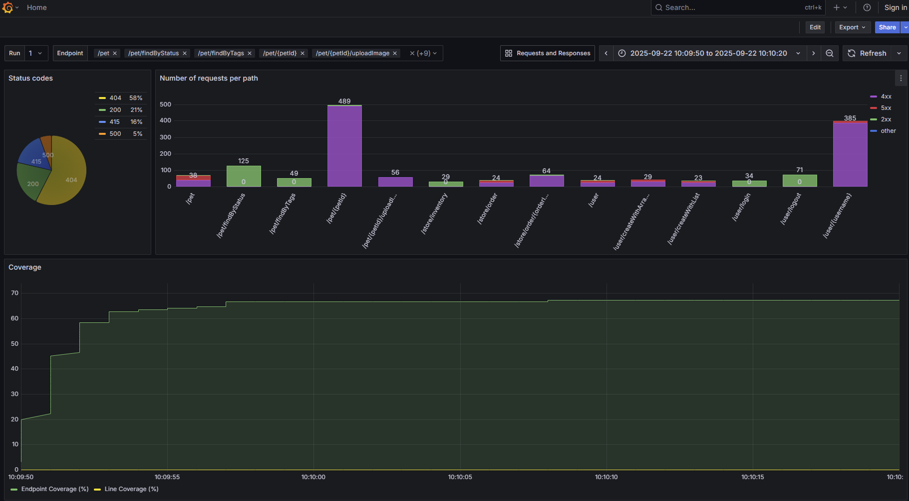
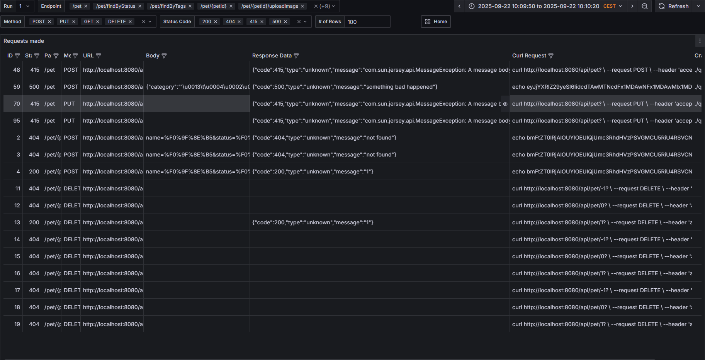
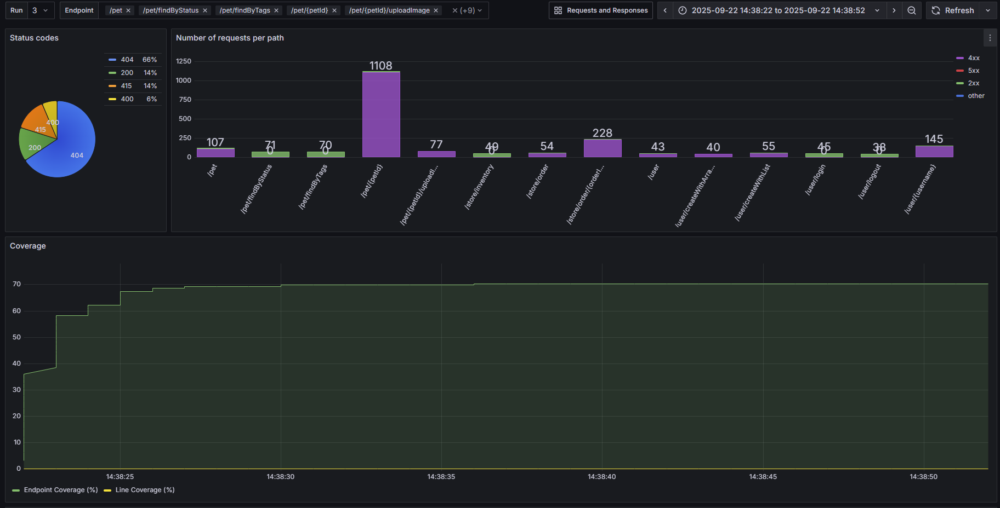

# WuppieFuzz-Workshop

Requirements:
- Docker
- Linux (or WSL)

## Setup

### Setting up WuppieFuzz

Install WuppieFuzz. [The repository is here](https://github.com/TNO-S3/WuppieFuzz), but you can also directly use the installer script for the latest version:
```sh
curl --proto '=https' --tlsv1.2 -LsSf https://github.com/TNO-S3/WuppieFuzz/releases/download/v1.2.0/wuppiefuzz-installer.sh | sh
```

Make sure the directory the fuzzer is installed into is part of your `PATH`.

### WuppieFuzz dashboard

Install the Wuppiefuzz dashboard. [The repository is here](https://github.com/TNO-S3/WuppieFuzz-dashboard), but here too you can use our installer script for the latest version:
```sh
curl --proto '=https' --tlsv1.2 -LsSf https://github.com/TNO-S3/WuppieFuzz-dashboard/releases/download/v0.2.0/wuppiefuzz-dashboard-installer.sh | sh
```

### Setting up the target

The target application used for this workshop is [Petstore](https://github.com/swagger-api/swagger-petstore/tree/master). For the purposes of this tutorial, we will specifically use version 1.0.6 with OpenAPI v2. We have made the setup easier by creating a Dockerfile that will download and start the target. Use the bash script from this repository to build the target Docker container and start it.

It expects an argument; give `false` for now (if `true`, the script patches a bug we will find using the fuzzer).

```sh
./start_petstore.sh false
```

This will start the target in its original form. It also loads the API specification from the target and converts it to a compatible format using the online Swagger convert service.

## Fuzzing basics with Wuppiefuzz

Once the target is active, we can start fuzzing:
```sh
wuppiefuzz fuzz --config blackbox-config.yaml
```

You will see a lot of output. The fuzzer also creates many files while it is working.

When WuppieFuzz has finished, we can look at the fuzzing results in the dashboard:

```sh
docker pull grafana/grafana-enterprise:latest
wuppiefuzz-dashboard start --database reports/grafana/report.db
```

The dashboard should be served at [localhost:3000](http://localhost:3000). You can stop the grafana server using

```sh
wuppiefuzz-dashboard stop
```

### Investigating bugs

View the logs of the pet store container using e.g.

```sh
docker logs --tail 1000 petstore_fuzz
```

The patch file in this repository fixes one error handling bug that could cause 500 errors to appear during your fuzzing campaign.
It can be applied to the source code, and the fixed version hosted via Docker, using

```sh
./start_petstore.sh true
```

Try fuzzing again, and see if there is a difference!

Note that the bash script also sends a test request to the container. This request triggers the bug patched in this tutorial, i.e. when called with `false` the test returns a `500` status code, and when called with `true` it correctly returns `400` to indicate a bad request.

## Walkthrough


Once the target is active, we can start fuzzing:
```sh
wuppiefuzz fuzz --config blackbox-config.yaml
```

You will see a lot of output. The fuzzer also creates many files while it is working.

When WuppieFuzz has finished, we can look at the fuzzing results in the dashboard:

```sh
docker pull grafana/grafana-enterprise:latest
wuppiefuzz-dashboard start --database reports/grafana/report.db
```

The dashboard should be served at [localhost:3000](http://localhost:3000). You can stop the grafana server using

```sh
wuppiefuzz-dashboard stop
```

View the dashboard at [localhost:3000](http://localhost:3000) in your prefered browser. After fuzzing for a minute or so the dashboard should look something like this:



At the top left of the dashboard we can select "Endpoints" from the dropdown menu to filter by endpoint. In the bar graph we can Ctrl-click on the 2xx, 4xx, 5xx, other options to select multiple at a time.

A noticeable result, and particularly so when only selecting the 5xx results, is that the `/pet` endpoint appears to generate a large number of 500 HTTP status codes. These are considered bugs by Wuppiefuzz and could be an indication of an underlying issue in the target application. To investigate this further we can look at the requests sent by Wuppiefuzz and the corresponding responses received. To do so, click on "Requests and Responses" at the top of the dashboard. The dashboard will look something like this:



On the second line we can see a POST request on the `/pet` endpoint that resulted in a 500 status code. We can inspect the body of the POST request which reveals something like this:
```json
{
  "category": "'\u0013\t\u0004\u0002\u0001@ ",
  "id": "Mf3Y,V+\u0015Y,V+\u0015",
  "name": "\u0018\f\u0002C!`0@",
  "photoUrls": "9\\.\u0017Kery",
  "status": ".Wk5\u001aMf3",
  "tags": "L&\u0013\tDbqx"
}
```

To gain insight into a possible cause for the bug we also consider a well-formed input that generated a 200 status code for a POST request to `/pet`, seen here:
```json
{
  "id": 13,
  "category": {
    "id": 0,
    "name": "🎵"
  },
  "name": "doggie",
  "photoUrls": [
    "🎵",
    "🎵"
  ],
  "tags": [
    {
      "id": 0,
      "name": "🎵"
    },
    {
      "id": 0,
      "name": "🎵"
    }
  ],
  "status": "sold"
}
```

Although there is a difference in the characters used between the faulty and the functional requests, there is also a difference in the structure. Namely, the faulty requests contains strings for each field, while the functional request has more complicated structures like a list of dictionaries.

To further investigate the cause of this 500 response we look at the source code of the target application. We are interested in the code for the POST request on the `/pet` endpoint which can be found in the file `WuppieFuzz-Workshop/swagger-petstore-swagger-petstore-v2-1.0.6/src/main/java/io/swagger/sample/resource/PetResource.java`. The code that handles the POST request can be found below.
<details>
<summary>
Code for the POST /pet endpoint
</summary>

```java
  @POST
  @Consumes({MediaType.APPLICATION_JSON, MediaType.APPLICATION_XML})
  @ApiOperation(value = "Add a new pet to the store")
  @ApiResponses(value = { @ApiResponse(code = 405, message = "Invalid input") })
  public Response addPet(
      @ApiParam(value = "Pet object that needs to be added to the store", required = true) Pet pet) {
    if (pet == null) {
      return Response.status(405).entity(new io.swagger.sample.model.ApiResponse(405, "no data")).build();
    }
    try {
      LOGGER.info("addPet ID {} STATUS {}", pet.getId(), pet.getStatus());
      if (LOGGER.isDebugEnabled()) {
        LOGGER.debug("addPet {}", Json.mapper().writeValueAsString(pet));
      }
    } catch (Throwable e) {
      e.printStackTrace();
    }
    Pet updatedPet = petData.addPet(pet);
    return Response.ok().entity(updatedPet).build();
  }
```
</details>


From this code we see that the input is JSON or XML (from the `@Consumes`) and the request body is converted to a `Pet` object. We can find the code that describes a `Pet` class in `WuppieFuzz-Workshop/swagger-petstore-swagger-petstore-v2-1.0.6/src/main/java/io/swagger/sample/model/Pet.java`, which can be seen below.
<details>
<summary>
Code for the Pet class
</summary>

```java
@XmlRootElement(name = "Pet")
public class Pet {
  private long id;
  private Category category;
  private String name;
  private List<String> photoUrls = new ArrayList<String>();
  private List<Tag> tags = new ArrayList<Tag>();
  private String status;

  @XmlElement(name = "id")
  public long getId() {
    return id;
  }

  public void setId(long id) {
    this.id = id;
  }

  @XmlElement(name = "category")
  public Category getCategory() {
    return category;
  }

  public void setCategory(Category category) {
    this.category = category;
  }

  @XmlElement(name = "name")
  @ApiModelProperty(example = "doggie", required = true)
  public String getName() {
    return name;
  }

  public void setName(String name) {
    this.name = name;
  }

  @XmlElementWrapper(name = "photoUrls")
  @XmlElement(name = "photoUrl", required = true)
  public List<String> getPhotoUrls() {
    return photoUrls;
  }

  public void setPhotoUrls(List<String> photoUrls) {
    this.photoUrls = photoUrls;
  }

  @XmlElementWrapper(name = "tags")
  @XmlElement(name = "tag")
  public List<Tag> getTags() {
    return tags;
  }

  public void setTags(List<Tag> tags) {
    this.tags = tags;
  }

  @XmlElement(name = "status")
  @ApiModelProperty(value = "pet status in the store", allowableValues = "available,pending,sold")
  public String getStatus() {
    return status;
  }

  public void setStatus(String status) {
    this.status = status;
  }
}
```

</details>

As can be seen, the `Pet` class will parse the body of the request according to the XmlElements as shown in the class, and will require conformance to the 
indicated data structures. From this we can see that the "tags" label requires a list of `Tag` objects which are defined here `WuppieFuzz-Workshop/swagger-petstore-swagger-petstore-v2-1.0.6/src/main/java/io/swagger/sample/model/Tag.java` and shown below.


<details>
<summary>
Code for the Tag class
</summary>

```java
@XmlRootElement(name = "Tag")
public class Tag {
  private long id;
  private String name;

  @XmlElement(name = "id")
  public long getId() {
    return id;
  }

  public void setId(long id) {
    this.id = id;
  }

  @XmlElement(name = "name")
  public String getName() {
    return name;
  }

  public void setName(String name) {
    this.name = name;
  }
}
```

</details>

This reveals that the "Tag" class has data types defined as a follows: 
```json
{
    id: long,
    name: String
}
```

Together with the definition of the Pet class, this indicates that the "Tags" field of a pet should be a list of dictionaries containing an "id" field as a long integer and a "name" field as a string. If this expectation is not met, as was the case with our request containing a string for the "tags" field, we are returned a 500 status code. 

The result of this investigation is the discovery that an incorrect JSON input is parsed incorrectly, resulting in a 500 status code. A 500 HTTP status code implies an "Internal Server Error", which is not the case. The correct response to a JSON parsing error would be a 400 Bad Request client error because the client has sent an invalid request. To resolve this we can add an exception to the Exception mapper found in `swagger-petstore-swagger-petstore-v2-1.0.6/src/main/java/io/swagger/sample/resource/SampleExceptionMapper.java`. Namely, we can add the following exception which will catch the JSON processing error:
```java
} else if (exception instanceof com.fasterxml.jackson.core.JsonProcessingException) {
      return Response.status(400)
          .entity(new ApiResponse(400, "bad input")).build();
```

With this fix our original faulty request will return the following response:
```
{"code":400,"type":"unknown","message":"bad input"}
```

To automatically apply this patch and restart the target application, simply run the following command:
```sh
./start_petstore.sh true
```

We can fuzz the target again after applying this patch to see the results. Before we start fuzzing we should stop the dashboard to avoid writing to the database file while the dashboard is reading it. To do so, run the following command:
```sh
wuppiefuzz-dashboard stop
```

Then run Wuppiefuzz again as before:
```sh
wuppiefuzz fuzz --config blackbox-config.yaml
```

The results of fuzzing the patched dashboard can be seen in the figure below. Due to the error handling of JSON parsing problems, there are no longer any 500 status codes. This makes further fuzzing of the target more practical because the errors that were not bugs have been filtered out and the target application returns more insightful error messages.


